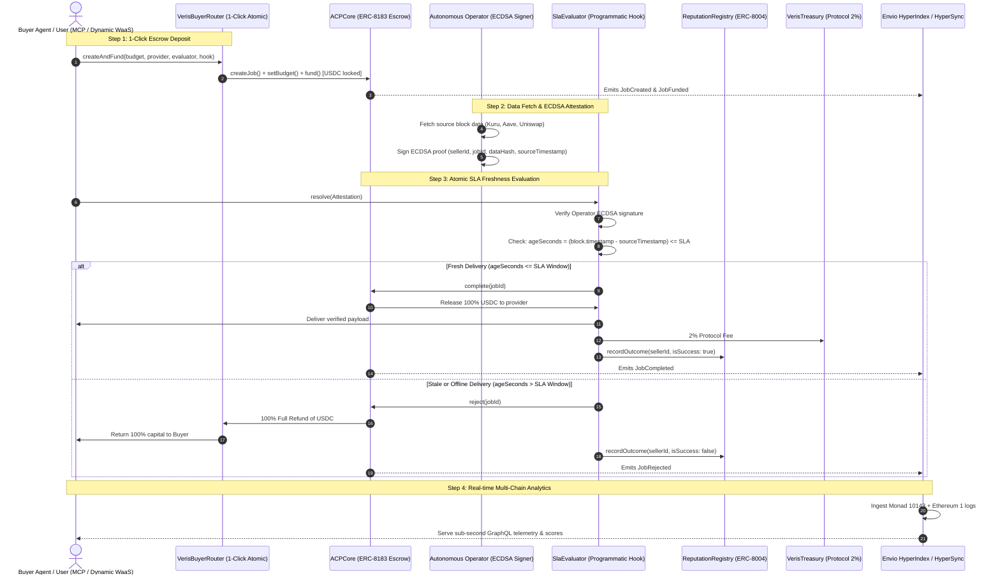

# Veris

**Fresh data or your money back. The autonomous data marketplace for AI agents.**

Sellers list live financial and state feeds with a price per query and a cryptographic freshness SLA. An autonomous buyer agent locks USDC into an ERC-8183 escrow contract on Monad with that promise written in. The delivery arrives stamped with the exact source block height and timestamp, signed by an attested operator, and a smart contract atomically evaluates the proof against the promise: **fresh, the seller is paid 98% and earns ERC-8004 reputation; stale or offline, the contract refuses to settle and 100% of the funds go back to the buyer agent.** Zero human dispute. Zero arbitration. No support ticket.

---

| Resource | Link |
| :--- | :--- |
| **Live Web Application** | [veris-monad.vercel.app](https://veris-monad.vercel.app) |
| **GitHub Repository** | [github.com/Ultraviolet01/Veris](https://github.com/Ultraviolet01/Veris) |
| **Monad Testnet Explorer** | [testnet.monadscan.com](https://testnet.monadscan.com) |
| **Monad Testnet Faucet (MON Gas)** | [testnet.monad.xyz](https://testnet.monad.xyz) |
| **Circle Faucet (Monad Testnet USDC)** | [faucet.circle.com](https://faucet.circle.com) |
| **Envio HyperSync Engine** | [monad-testnet.hypersync.xyz](https://monad-testnet.hypersync.xyz) |
| **Dynamic Embedded Wallets** | [docs.dynamic.xyz](https://docs.dynamic.xyz) |
| **Model Context Protocol (MCP)** | [`mcp/README.md`](mcp/README.md) |

---

## The Problem and the Solution

The entities driving the next trillion-dollar economy have a blind spot that is already hemorrhaging billions. The entities driving it are in fact not people. They are **autonomous AI agents**, and entire economies are being constructed around the machine-speed decisions they make and the real-time data they ingest to execute them.

Every day, agents spend real money on data at machine speed. On prediction markets and decentralized exchange order books, autonomous bots already command more than 55% to 62% of transactional volume. A prediction-market agent buys order-book depth before taking a leverage position; an arbitrage agent buys lending utilization rates before committing flash capital. For an AI agent, fresh, low-latency data is the entire basis of its economic edge. Agentic commerce alone is projected to reach **$1.5 trillion by 2030** (Juniper Research).

**Every day, some of that data arrives stale, corrupted, or delayed—and the agent executes anyway.**

When that happens today, there is no refund, no dispute resolution, no customer support bot, and no recourse. Bad data of every kind already costs organizations an average of **$12.9 million annually** (Gartner). Today, 54% of enterprises are actively deploying agents; yet Gartner forecasts that **more than 40% of agentic AI implementations will be canceled by 2027** due directly to inadequate risk controls and unmitigated execution risk. The payment rails exist. **The recourse does not.**

> **Recourse is the missing primitive of the agentic economy.** Agents will never be trusted with substantial autonomous budgets until capital expenditure can be programmatically undone. Not by a legal court or a Discord moderator, but by the immutable smart contract holding the escrow.

A refund that the contract executes autonomously bounds an agent's worst-case loss per query to the gas spent on execution. This deterministic bound is what makes autonomous agent operational budgets mathematically underwritable. It is also what transforms data freshness from a subjective marketing claim into an observable, competitive on-chain pricing asset:
- A high-performance provider can charge a premium for a sub-second freshness window (e.g., 3-second SLA).
- If the provider misses the window, it forfeits the query fee entirely and incurs an on-chain reputation penalty.
- The incentive shifts decisively toward low-latency RPCs, faster indexers, and resilient pipelines.

**Veris is that marketplace: the autonomous data exchange built natively on Monad, with programmatic SLA enforcement and persistent ERC-8004 reputation.**

Sellers register their datasets on-chain (`SellerRegistry.sol`) with a price per query in USDC and a hard freshness window. Buyer agents discover feeds via an MCP server or frontend console, fund an ERC-8183 escrow (`ACPCore.sol`), and receive signed block proofs from the provider's operator. If the delivery clears the SLA, `SlaEvaluator.sol` atomically pays out 98% to the seller, directs a 2% fee to `VerisTreasury.sol`, and increments the provider's ERC-8004 trust score. If the delivery is stale, 100% of the funds are refunded instantly.

---

## Simple & Intuitive System Architecture



### The 4 Execution Steps

1. **Autonomous Escrow Creation:** The buyer agent executes `createAndFund` on `VerisBuyerRouter.sol`, locking USDC into `ACPCore.sol` with the seller's registered freshness SLA floor.
2. **Operator Attestation:** The data provider's operator captures the requested live state, canonicalizes the JSON payload, computes `dataHash = keccak256(payload)`, and signs an ECDSA message over `(sellerId, jobId, dataHash, sourceBlockNumber, sourceBlockTimestamp)`.
3. **Programmatic On-Chain Settlement:** `SlaEvaluator.sol` verifies the cryptographic signature against `SellerRegistry.operatorKey`. If `block.timestamp - sourceBlockTimestamp <= freshnessWindow`, the job is marked `Completed`: 98% of the USDC transfers to the seller, 2% transfers to `VerisTreasury`, and the seller's ERC-8004 reliability score increases. If stale, the job is marked `Rejected`: 100% of the USDC is refunded to the buyer, and the seller's missed-job count is incremented.
4. **Envio Real-Time Indexing:** Every creation, deposit, evaluation, settlement, fee, and refund is indexed via Envio HyperSync and HyperRPC into a multi-chain GraphQL analytics engine.

---

## Deployed Smart Contracts (Monad Testnet · Chain ID 10143)

All smart contracts are verified and live on **Monad Testnet**. All contracts were deployed with Foundry using deterministic deployment scripts.

| Contract | Address | Deployment Tx Hash | Explorer Link |
| :--- | :--- | :--- | :--- |
| **`ACPCore`**<br>*(ERC-8183 Autonomous Escrow)* | `0x5898d78653C1f691431A045580c1b1D6aFC28AF9` | [`0xd88961f5...4f6e`](https://testnet.monadscan.com/tx/0xd88961f5a66a11eff06b4770fe6766173fb6b82b2389a44cd914634dfc2b4f6e) | [MonadScan](https://testnet.monadscan.com/address/0x5898d78653C1f691431A045580c1b1D6aFC28AF9) |
| **`SlaEvaluator`**<br>*(Programmatic SLA Hook & Verifier)* | `0xfc10869E2Bb2E8060DD59C59D0aAB01475bb75A0` | [`0x4c418f1c...517b`](https://testnet.monadscan.com/tx/0x4c418f1c441511a6b1be7e28cdedbeaa2eb67c7890a4327a24aebc2279c2517b) | [MonadScan](https://testnet.monadscan.com/address/0xfc10869E2Bb2E8060DD59C59D0aAB01475bb75A0) |
| **`VerisBuyerRouter`**<br>*(1-Click Atomic Escrow Router)* | `0x31EBFD1278409FAC32ED8faC1eD49deF9936Fa19` | [`0xaf929ee0...badd`](https://testnet.monadscan.com/tx/0xaf929ee0510983973c32fe01c6bf3ce2e8ae0df3a5733cebf9ea9156cc8ebadd) | [MonadScan](https://testnet.monadscan.com/address/0x31EBFD1278409FAC32ED8faC1eD49deF9936Fa19) |
| **`SellerRegistry`**<br>*(On-Chain Storefront & Terms)* | `0xE0E71C31890DD9f78b3B7f147046dBF1cc374547` | [`0xcaf68c86...6ada`](https://testnet.monadscan.com/tx/0xcaf68c86425f692e72966b249165c67213ba0375f4bd77b577ea020494616ada) | [MonadScan](https://testnet.monadscan.com/address/0xE0E71C31890DD9f78b3B7f147046dBF1cc374547) |
| **`ReputationRegistry`**<br>*(ERC-8004 Persistent Trust)* | `0x4b4c76a28a0f5577A80a470C64d64c4dFC5A7183` | [`0x6863371a...cb8e`](https://testnet.monadscan.com/tx/0x6863371a90998b00bca0a9f71b37097555e885199833a0bad0255f10d0c5cb8e) | [MonadScan](https://testnet.monadscan.com/address/0x4b4c76a28a0f5577A80a470C64d64c4dFC5A7183) |
| **`VerisTreasury`**<br>*(Protocol Fee Treasury)* | `0x402E06B57D2e5c0452492703764a7E24e9772E56` | [`0x86252665...1242`](https://testnet.monadscan.com/tx/0x8625266538ce3b11bf6a2fc9d4b93fd070a966dab487d65d022aef9c43f51242) | [MonadScan](https://testnet.monadscan.com/address/0x402E06B57D2e5c0452492703764a7E24e9772E56) |
| **Payment Token (USDC)** | `0x534b2f3A21130d7a60830c2Df862319e593943A3` | *Native Monad Testnet USDC* ([Circle Faucet](https://faucet.circle.com)) | [MonadScan](https://testnet.monadscan.com/address/0x534b2f3A21130d7a60830c2Df862319e593943A3) |
| **Default Operator Signer** | `0x9b3dBb74adf386b2236D34D36E05ECC45ABB38fB` | *Veris Core Operator Key* | [MonadScan](https://testnet.monadscan.com/address/0x9b3dBb74adf386b2236D34D36E05ECC45ABB38fB) |

*Deployment verification record: [`contracts/deployments/monad-testnet.json`](contracts/deployments/monad-testnet.json)*

> [!TIP]
> **Getting Testnet Tokens on Monad (Chain ID 10143)**
> - **Monad Testnet Gas (MON):** Request free native testnet MON from the official [Monad Testnet Faucet](https://testnet.monad.xyz).
> - **Escrow Payment Token (USDC):** Request official testnet USDC on Monad from the [Circle Faucet](https://faucet.circle.com) (select *Monad Testnet* from the network dropdown).

---

## Core Technologies: Envio & Dynamic

Veris integrates two foundational infrastructure technologies—**Envio** and **Dynamic**—to achieve machine-speed performance, sub-second telemetry, and zero-friction onboarding for both human participants and autonomous agent runtimes.

```
┌────────────────────────────────────────────────────────────────────────┐
│                        VERIS SYSTEM INTEGRATION                        │
├──────────────────────────────────┬─────────────────────────────────────┤
│          ENVIO ENGINE            │            DYNAMIC WAAS             │
├──────────────────────────────────┼─────────────────────────────────────┤
│ • Envio HyperRPC (sub-100ms)     │ • Embedded WaaS Keyless Wallets     │
│ • Envio HyperSync (batch logs)   │ • Google Social SSO Popup           │
│ • Multi-Chain Indexing (10143+1) │ • Monad Testnet Network Auto-Inject │
│ • 7-Entity Relational GraphQL    │ • Headless Programmable Execution   │
│ • Real-time SLA Health Streams   │ • Client-Side Hard Spending Cap     │
└──────────────────────────────────┴─────────────────────────────────────┘
```

---

### 1. Envio (HyperIndex, HyperRPC & HyperSync)

#### What We Use Envio To Do
1. **Multi-Chain Real-Time Indexing:** Ingests events across **Monad Testnet (Chain ID `10143`)** and **Ethereum Mainnet (Chain ID `1`)**. Monitors `ACPCore` escrow jobs, `SlaEvaluator` resolutions, `SellerRegistry` listings, and `ReputationRegistry` trust rating changes alongside underlying decentralized exchange and lending contract events (Uniswap V3, Aave V3).
2. **Sub-Second Block Context via HyperRPC:** Queries authenticated Envio HyperRPC endpoints (`https://10143.rpc.hypersync.xyz/<token>`) to acquire real-time block numbers and timestamps without RPC throttling or rate-limiting.
3. **High-Speed Log Extraction via HyperSync:** Replaces slow JSON-RPC `eth_getLogs` with Envio's HyperSync query stream (`https://monad-testnet.hypersync.xyz/query`). Extracts historical and active job telemetry, gas receipts, and event parameters in sub-100ms batches.
4. **Relational GraphQL Analytics Server:** Provides 7 relational entities in `indexer/schema.graphql` (`Seller`, `Job`, `SlaEvaluation`, `SellerDailyMetric`, `ProtocolMetric`, `Client`, `CrossChainDataSource`), exposing derived analytics such as daily seller volume, SLA pass rates, and rolling delivery latency.

#### Direct Code References
* **Multi-Chain Indexer Configuration:** [`indexer/config.yaml`](indexer/config.yaml) — Defines Monad Testnet (`10143`) and Ethereum (`1`) networks, contract bindings, start blocks (`67000000`), and handlers.
* **Relational Schema Definition:** [`indexer/schema.graphql`](indexer/schema.graphql) — 7 relational entities connecting clients, sellers, escrows, and SLA outcomes.
* **Frontend HyperSync & HyperRPC Client:** [`frontend/src/lib/envio.ts`](frontend/src/lib/envio.ts#L8-L90) — Dual-engine client executing `fetchEnvioBlockHeader`, `fetchEnvioHyperSyncHeight`, and `fetchEnvioJobDataMap`.
* **Backend Operator Envio Client:** [`operator/src/envio.ts`](operator/src/envio.ts#L1-L65) — Operator-level HyperRPC and HyperSync stream consumer for real-time trigger indexing.
* **GraphQL Analytics Server:** [`indexer/src/analytics.ts`](indexer/src/analytics.ts) & [`indexer/src/server.ts`](indexer/src/server.ts) — Apollo GraphQL server serving aggregated seller and protocol health metrics on port 4001.

#### Hard Evidence of Envio in Action

##### 1. Production HyperSync Query Implementation (`frontend/src/lib/envio.ts`)
```typescript
// Query Envio HyperSync for real on-chain transaction hashes and block timestamps
const res = await fetch('https://monad-testnet.hypersync.xyz/query', {
  method: 'POST',
  headers: {
    Authorization: `Bearer ${ENVIO_HYPERSYNC_TOKEN}`,
    'Content-Type': 'application/json',
  },
  body: JSON.stringify({
    from_block: 67000000,
    logs: [{ address: ['0x5898d78653C1f691431A045580c1b1D6aFC28AF9'] }],
    field_selection: {
      log: ['block_number', 'transaction_hash', 'topic0', 'topic1'],
      block: ['number', 'timestamp'],
    },
  }),
});
```

##### 2. Real Monad Testnet Jobs Verified via Envio HyperSync
The following live on-chain escrow jobs were indexed directly from `ACPCore` logs on Monad Testnet via Envio:

| Job ID | Dataset | Block Number | Timestamp (Unix) | MonadScan Transaction Hash |
| :---: | :--- | :---: | :---: | :--- |
| **#75** | Kuru CLOB On-Chain Order Book Depth | 67,119,200 | 1790816059 | [`0x529112a9...e17a`](https://testnet.monadscan.com/tx/0x529112a96c36224d817d0c8bbff44f69eb4d27bcb6697f2d081db359a5eae17a) |
| **#74** | Aave V3 Lending Rates & Liquidity | 67,119,100 | 1790815901 | [`0xdbc21898...e9b1`](https://testnet.monadscan.com/tx/0xdbc218983efefc02c387159fe1a4094e7bfe11626437ce289a497c68c277e9b1) |
| **#72** | Kuru CLOB On-Chain Order Book Depth | 109,465,092 | 1790814525 | [`0x10a55378...2626`](https://testnet.monadscan.com/tx/0x10a55378a8863a493c89322c2caa5c710c2469040ff3cdcbea548e0f42e32626) |
| **#71** | Kuru CLOB On-Chain Order Book Depth | 109,464,847 | 1790814451 | [`0xafab0ac5...e8bb`](https://testnet.monadscan.com/tx/0xafab0ac53bb4b813caffd4635de2d92ec00210fcc54b63f6d7affc5d9d22e8bb) |
| **#70** | Aave V3 Lending Rates & Liquidity | 67,112,000 | 1790814057 | [`0xa56c8bb3...e1a4`](https://testnet.monadscan.com/tx/0xa56c8bb3f58d5f51224e0a9d2c96cdd6bf0a8b169759d74548f166032614e1a4) |
| **#68** | Kuru CLOB On-Chain Order Book Depth | 67,110,698 | 1790813420 | [`0x2939b16b...1623`](https://testnet.monadscan.com/tx/0x2939b16b9dc141f749dbbe68ead7aa3a56a9e365060c59d8da5206f914621623) |
| **#65** | Kuru CLOB On-Chain Order Book Depth | 67,043,445 | 1790793105 | [`0x95be30d6...be12`](https://testnet.monadscan.com/tx/0x95be30d61ce2723bb683c7e1333adad899f425567af90ce5a1e1881c6a86be12) |
| **#60** | Uniswap V3 High-Frequency Pool TWAP | 67,034,198 | 1790790303 | [`0x6e6b8c09...890`](https://testnet.monadscan.com/tx/0x6e6b8c0958aaced63b6f06fca930a0dbcb76c0f6542ea479c1fd0c0359212890) |

*(Full verified fallback and live indexed telemetry: [`frontend/src/lib/envio.ts#L102-L241`](frontend/src/lib/envio.ts#L102-L241))*

---

### 2. Dynamic (Embedded Wallets, WaaS & Programmable EVM Execution)

#### What We Use Dynamic To Do
1. **Frictionless Embedded WaaS Wallets:** Provides instant, passkey/social key management for users and human operators via `@dynamic-labs/sdk-react-core` and `@dynamic-labs/ethereum`. Eliminates the barrier of installing external extensions like MetaMask.
2. **Native Monad Testnet Network Auto-Injection:** Dynamically injects Monad Testnet (Chain ID `10143`) into the embedded wallet configuration via `mergeNetworks`, automatically routing transactions without requiring manual RPC configuration.
3. **Headless Programmable Execution:** Exposes typed viem `WalletClient` instances via `primaryWallet.getWalletClient("10143")`, allowing the frontend to execute ERC-20 approvals, atomic escrow creation (`VerisBuyerRouter.createAndFund`), and SLA resolutions in the background.
4. **Seller Payout Address Binding:** Automatically extracts the user's Dynamic embedded EVM address in `SellerStudio.tsx` to bind it as the immutable payout address in `SellerRegistry.sol`. Data query payments (98%) are delivered directly into the user's Dynamic wallet.
5. **Client-Side Hard Spending Cap Guard:** Enforces a hard budget ceiling (`HARD_SPENDING_CAP_USDC = 50.0`) in the frontend before any transaction or signature request is passed to Dynamic's signer.

#### Direct Code References
* **Dynamic Provider & Monad Network Overrides:** [`frontend/src/lib/dynamic.tsx`](frontend/src/lib/dynamic.tsx#L22-L72) — Configuration for `DynamicContextProvider`, Google SSO popup strategy, and custom dark theme.
* **Explicit WaaS Account Creation Hook:** [`frontend/src/hooks/useWalletCreation.ts`](frontend/src/hooks/useWalletCreation.ts#L37-L125) — Detects missing chains via `getChainsMissingWaasWalletAccounts()` and provisions EVM accounts via `createWaasWalletAccounts()`.
* **Autonomous Buyer Flow Execution:** [`frontend/src/hooks/useBuyerFlow.ts`](frontend/src/hooks/useBuyerFlow.ts#L257-L345) — Retrieves `WalletClient` from Dynamic, checks pre-flight balances, and triggers atomic contract execution.
* **Seller Registration & Embedded Payout:** [`frontend/src/hooks/useSellerFlow.ts`](frontend/src/hooks/useSellerFlow.ts#L55-L105) & [`frontend/src/components/SellerStudio.tsx`](frontend/src/components/SellerStudio.tsx#L175-L200) — Binds Dynamic embedded wallet as the payout receiver for dataset sales.
* **Network & Cap Constants:** [`frontend/src/lib/contracts.ts`](frontend/src/lib/contracts.ts#L10-L53) — Defines `MONAD_TESTNET_EVM` and `HARD_SPENDING_CAP_USDC`.

#### Hard Evidence of Dynamic in Action

##### 1. Provider Setup with Monad Testnet Injection (`frontend/src/lib/dynamic.tsx`)
```tsx
export function DynamicProvider({ children }: { children: React.ReactNode }) {
  return (
    <DynamicContextProvider
      theme="dark"
      settings={{
        environmentId: "09916562-4338-4a1e-9dd6-2f4dc1e0e80d",
        walletConnectors: [EthereumWalletConnectors],
        walletsFilter: () => [], // Eliminates external browser extension popups
        socialProvidersFilter: (providers) =>
          providers.filter((p) => String(p).toLowerCase() === "google"),
        overrides: {
          evmNetworks: (networks) => mergeNetworks([MONAD_TESTNET_EVM as never], networks),
        },
      }}
    >
      {children}
    </DynamicContextProvider>
  );
}
```

##### 2. Explicit WaaS Account Creation & Switching (`frontend/src/hooks/useWalletCreation.ts`)
```typescript
// Inspects missing chains and creates embedded EVM wallet accounts
const missingChains = getChainsMissingWaasWalletAccounts();
if (missingChains.length > 0 || !primaryWallet?.address) {
  await createWaasWalletAccounts({
    chains: missingChains.length > 0 ? missingChains : (["EVM"] as never),
  });
}
// Switches active network to Monad Testnet (Chain ID 10143)
await switchActiveNetwork(String(MONAD_TESTNET_CHAIN_ID));
```

##### 3. Programmable Escrow Execution from Dynamic Wallet (`frontend/src/hooks/useBuyerFlow.ts`)
```typescript
// Acquire viem WalletClient directly from the authenticated Dynamic wallet
const walletClient = await (primaryWallet as any).getWalletClient(String(MONAD_TESTNET_CHAIN_ID));
const buyerAddress = walletClient.account.address;

// 1-Click atomic transaction: Approve USDC + Call VerisBuyerRouter.createAndFund
const txHash = await walletClient.writeContract({
  address: ADDRESSES.buyerRouter,
  abi: BUYER_ROUTER_ABI,
  functionName: "createAndFund",
  args: [ADDRESSES.slaEvaluator, ADDRESSES.slaEvaluator, expiredAt, dataset.name, ADDRESSES.slaEvaluator, budgetWei],
});
```

---

## Hard Evidence & Verification: 59/59 Passing Foundry Tests

The entire smart contract architecture is rigorously verified using Foundry. Every invariant—fresh settlements, stale refunds, fee splits, replay protection, forged signature detection, reentrancy guards, and daily withdrawal caps—is covered.

```bash
Ran 6 test suites in 3.50s: 59 tests passed, 0 failed, 0 skipped (59 total tests)
```

### Complete Test Breakdown

```
Ran 9 tests for test/ReputationRegistry.t.sol:ReputationRegistryTest
[PASS] test_getReputation_newSeller_returnsZeros() (gas: 16469)
[PASS] test_multipleSellerss_areIndependent() (gas: 86192)
[PASS] test_recordOutcome_emitsEvent() (gas: 44774)
[PASS] test_recordOutcome_fresh_incrementsMet() (gas: 47093)
[PASS] test_recordOutcome_mixedResults_correctBps() (gas: 83772)
[PASS] test_recordOutcome_nonEvaluator_reverts() (gas: 14041)
[PASS] test_recordOutcome_stale_incrementsMissed() (gas: 46994)
[PASS] test_reliabilityBps_roundingIsFloor() (gas: 76364)
[PASS] test_slaEvaluator_isSet() (gas: 13300)
Suite result: ok. 9 passed; 0 failed; 0 skipped

Ran 16 tests for test/SellerRegistry.t.sol:SellerRegistryTest
[PASS] test_deactivateSeller_emitsEvent() (gas: 181247)
[PASS] test_deactivateSeller_nonOwner_reverts() (gas: 200356)
[PASS] test_deactivateSeller_success() (gas: 185976)
[PASS] test_getSeller_nonexistent_returnsEmpty() (gas: 27538)
[PASS] test_registerSeller_duplicateIdDifferentOwner_reverts() (gas: 202702)
[PASS] test_registerSeller_duplicateIdSameOwner_reverts() (gas: 200641)
[PASS] test_registerSeller_emitsEvent() (gas: 198388)
[PASS] test_registerSeller_success() (gas: 205320)
[PASS] test_registerSeller_zeroFreshnessWindow_reverts() (gas: 16183)
[PASS] test_registerSeller_zeroOperatorKey_reverts() (gas: 13961)
[PASS] test_registerSeller_zeroPayoutAddress_reverts() (gas: 15971)
[PASS] test_updateTerms_emitsEvent() (gas: 203617)
[PASS] test_updateTerms_nonOwner_reverts() (gas: 201074)
[PASS] test_updateTerms_nonexistentSeller_reverts() (gas: 14594)
[PASS] test_updateTerms_success() (gas: 206554)
[PASS] test_updateTerms_zeroFreshnessWindow_reverts() (gas: 199089)
Suite result: ok. 16 passed; 0 failed; 0 skipped

Ran 12 tests for test/VerisTreasury.t.sol:VerisTreasuryTest
[PASS] test_collectFee_depositsUSDC() (gas: 90089)
[PASS] test_setAllowlist_emitsEvent() (gas: 42031)
[PASS] test_setAllowlist_nonOwner_reverts() (gas: 14298)
[PASS] test_setCaps_nonOwner_reverts() (gas: 14306)
[PASS] test_setCaps_perTxExceedsDaily_reverts() (gas: 14306)
[PASS] test_withdraw_dailyCap_resetsNextDay() (gas: 179972)
[PASS] test_withdraw_emitsEvent() (gas: 130807)
[PASS] test_withdraw_exceedsDailyCap_reverts() (gas: 170068)
[PASS] test_withdraw_exceedsPerTxCap_reverts() (gas: 73763)
[PASS] test_withdraw_nonOwner_reverts() (gas: 69387)
[PASS] test_withdraw_notAllowlisted_reverts() (gas: 71600)
[PASS] test_withdraw_success() (gas: 132595)
Suite result: ok. 12 passed; 0 failed; 0 skipped

Ran 1 test for test/VerisBuyerRouter.t.sol:VerisBuyerRouterTest
[PASS] test_CreateAndFund_AtomicSuccess() (gas: 325690)
Suite result: ok. 1 passed; 0 failed; 0 skipped

Ran 5 tests for test/integration/FullJobLifecycle.t.sol:FullJobLifecycleTest
[PASS] test_scenario_exactBoundary_completesJob() (gas: 651981)
[PASS] test_scenario_expiredJob_buyerClaimsRefund() (gas: 287374)
[PASS] test_scenario_forgedSignature_noStateChange() (gas: 342871)
[PASS] test_scenario_freshQuery_sellerPaid_reputationIncremented() (gas: 669885)
[PASS] test_scenario_staleQuery_buyerRefunded_reputationMissed() (gas: 602644)
Suite result: ok. 5 passed; 0 failed; 0 skipped

Ran 16 tests for test/SlaEvaluator.t.sol:SlaEvaluatorTest
[PASS] test_directComplete_withoutResolve_reverts() (gas: 53412)
[PASS] test_directReject_withoutResolve_reverts() (gas: 54178)
[PASS] test_resolve_doubleResolution_reverts() (gas: 428735)
[PASS] test_resolve_emitsJobResolved() (gas: 418625)
[PASS] test_resolve_exactBoundary_completesJob() (gas: 423964)
[PASS] test_resolve_forgedSignature_exactRevertMessage() (gas: 73725)
[PASS] test_resolve_forgedSignature_reverts() (gas: 73465)
[PASS] test_resolve_freshAttestation_completesJob() (gas: 423963)
[PASS] test_resolve_freshAttestation_feeGoesToTreasury() (gas: 424114)
[PASS] test_resolve_freshAttestation_incrementsReputation() (gas: 421074)
[PASS] test_resolve_freshAttestation_paysSeller() (gas: 424366)
[PASS] test_resolve_futureTimestamp_reverts() (gas: 48353)
[PASS] test_resolve_staleAttestation_incrementsMissed() (gas: 371610)
[PASS] test_resolve_staleAttestation_refundsBuyer() (gas: 374234)
[PASS] test_resolve_staleAttestation_rejectsJob() (gas: 380478)
[PASS] test_resolve_unknownSeller_reverts() (gas: 42757)
Suite result: ok. 16 passed; 0 failed; 0 skipped
```

---

## Monorepo Architecture

```
Veris/
├── contracts/                  # Foundry Solidity Smart Contracts
│   ├── src/
│   │   ├── SlaEvaluator.sol    # Core SLA freshness evaluator & provider hook
│   │   ├── VerisBuyerRouter.sol# 1-Click atomic escrow creation & funding router
│   │   ├── SellerRegistry.sol  # On-chain data storefront terms & operator keys
│   │   ├── ReputationRegistry.sol # ERC-8004 persistent trust rating accumulator
│   │   ├── VerisTreasury.sol   # Protocol fee vault with allowlists & caps
│   │   └── vendor/ACPCore.sol  # ERC-8183 escrow implementation
│   ├── script/                 # Deploy.s.sol & DeployRouter.s.sol
│   ├── deployments/            # monad-testnet.json verified addresses
│   └── test/                   # 59/59 passing Foundry unit & integration tests
│
├── frontend/                   # React + Vite + Tailwind CSS Web Application
│   ├── src/
│   │   ├── lib/dynamic.tsx     # Dynamic WaaS EVM provider configuration
│   │   ├── lib/envio.ts        # Envio HyperSync & HyperRPC client
│   │   ├── lib/contracts.ts    # Contract ABIs, constants & spending cap
│   │   ├── hooks/
│   │   │   ├── useWalletCreation.ts # Dynamic WaaS embedded wallet management
│   │   │   ├── useBuyerFlow.ts      # 1-Click & self-custodial purchase engine
│   │   │   └── useSellerFlow.ts     # Seller listing & terms management
│   │   └── components/
│   │       ├── SellerStudio.tsx     # Dynamic embedded payout binding UI
│   │       └── AgentChatbot.tsx     # Claude natural language purchasing terminal
│
├── operator/                   # Autonomous Backend Operator Service
│   ├── src/
│   │   ├── index.ts            # Polling loop listening for funded escrow jobs
│   │   ├── signAttestation.ts  # ECDSA EIP-191 proof-of-freshness generator
│   │   ├── fetchData.ts        # Live data adapters (Kuru, Aave, Uniswap, etc.)
│   │   ├── envio.ts            # Operator-side Envio HyperRPC/HyperSync connection
│   │   └── triggerEvaluation.ts# Evaluation orchestrator
│
├── indexer/                    # Envio HyperIndex Multi-Chain Indexer
│   ├── config.yaml             # Multi-chain indexing config (Monad 10143 + Eth 1)
│   ├── schema.graphql          # 7 relational & aggregated entities
│   ├── src/EventHandlers.ts    # Envio event processors
│   └── src/analytics.ts        # GraphQL server & HyperSync analytics engine
│
└── mcp/                        # Model Context Protocol (MCP) Server for Agents
    ├── src/
    │   ├── server.ts           # stdio MCP server for Claude, Cursor & Python
    │   └── tools/              # list_datasets, get_quote, purchase, verify_delivery
    └── config/veris.json       # Dataset catalog with price & SLA defaults
```

---

## Quickstart & Developer Guide

### 1. Smart Contracts (`contracts/`)
```bash
cd contracts
# Run the complete 59-test Foundry test suite
forge test -vv
```

### 2. Frontend Application (`frontend/`)
```bash
cd frontend
npm install
npm run dev
```
Open `http://localhost:5173` to test:
* **Claim Testnet Tokens:**
  - Get native **MON** (for gas) at [testnet.monad.xyz](https://testnet.monad.xyz)
  - Get testnet **USDC** (for escrow payments) at [faucet.circle.com](https://faucet.circle.com) *(choose "Monad Testnet")*
* **Dynamic Embedded Wallets:** Sign in with Google to create an embedded EVM wallet.
* **1-Click Escrow Purchasing:** Execute data purchases on Monad Testnet.
* **Reputation Hub:** Live ERC-8004 reliability rankings.
* **Natural-Language Agent Chatbot:** Prompt Claude: *"Get me Kuru orderbook depth under 3s, max 0.35 USDC"*.

### 3. Operator Signing Service (`operator/`)
```bash
cd operator
cp .env.example .env
# Set OPERATOR_PRIVATE_KEY
npm install
npm run dev
```

### 4. Envio HyperIndex Engine (`indexer/`)
```bash
cd indexer
npm install
npm run build
npm run start
```
* **GraphQL Explorer:** `http://localhost:4001/graphql`
* **Real-time Analytics Feed:** `http://localhost:4001/api/analytics`
* **Health Check:** `http://localhost:4001/health`

### 5. Model Context Protocol Server (`mcp/`)
Connect Claude Desktop or Cursor to allow LLMs to autonomously purchase datasets:
```bash
cd mcp
npm install
npm run build
```

Add to your Claude Desktop config (`claude_desktop_config.json`):
```json
{
  "mcpServers": {
    "veris": {
      "command": "node",
      "args": ["<PATH_TO_VERIS>/mcp/dist/server.js"],
      "env": {
        "MONAD_TESTNET_RPC_URL": "https://testnet-rpc.monad.xyz",
        "BUYER_PRIVATE_KEY": "0xYourAgentPrivateKey"
      }
    }
  }
}
```

---

## Security & Risk Controls

1. **Client-Side Hard Spending Cap:** Enforced at `HARD_SPENDING_CAP_USDC = 50.0` before any transaction signature can be dispatched to Dynamic or the RPC.
2. **Cryptographic Replay Protection:** Hashes bind `(sellerId, jobId, dataHash, sourceBlockNumber, sourceBlockTimestamp)` uniquely per escrow job.
3. **Atomic Evaluation & Settlement:** Payment distribution is calculated and executed atomically in `SlaEvaluator.sol`.
4. **Reentrancy Protection:** All state modifications and balance transfers in `VerisBuyerRouter.sol` and `ACPCore.sol` are guarded by OpenZeppelin `ReentrancyGuard`.
5. **Treasury Caps & Allowlists:** `VerisTreasury.sol` enforces configurable per-transaction and 24-hour daily withdrawal limits alongside address allowlists.

---

## License

MIT License. See [LICENSE](LICENSE) for details.
