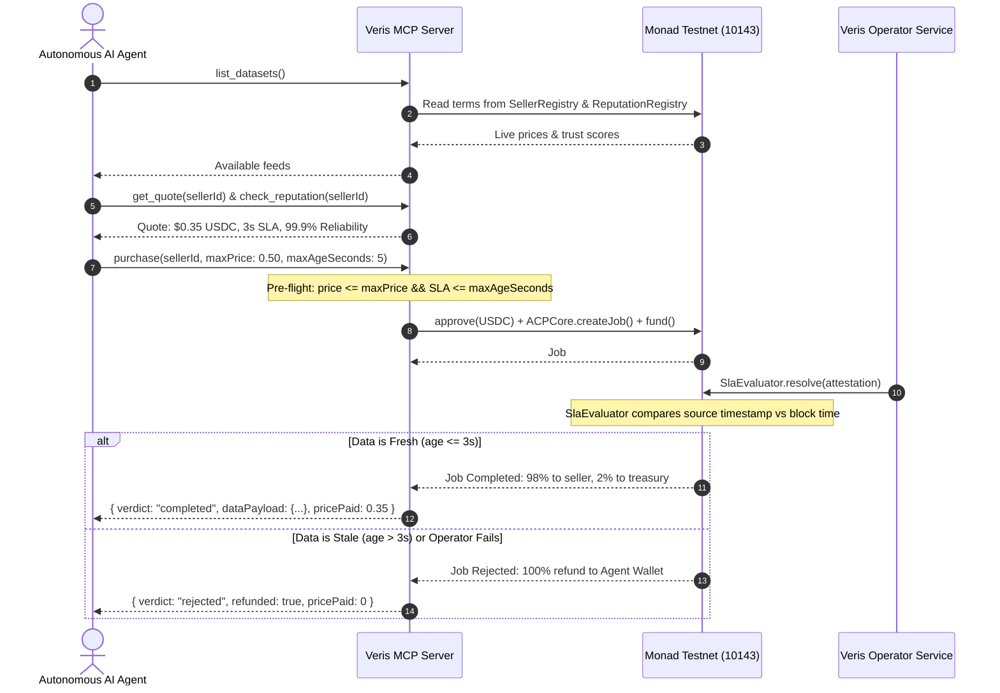

# Veris MCP Server — Developer & Agent Integration Guide

> **Protocol Target:** Monad Testnet (Chain ID `10143`)  
> **Package:** `@veris/mcp-server`  
> **Standard:** Model Context Protocol (MCP) over Stdio Transport

The **Veris MCP Server** allows autonomous AI agents (Claude, Cursor, LangChain, AutoGen, CrewAI, Custom LLMs) to discover, quote, and purchase real-time on-chain datasets protected by self-enforcing SLA escrow.

If the delivered data is fresh within the seller's promised window (e.g. `<= 3s`), the seller is paid and the protocol collects a 2% fee. If the data is stale or the operator fails to respond, the escrow contract **automatically refunds 100% of the funds to the agent wallet**.

---

## 1. Integration Modes

### Option 1: Zero-Install via NPX (Recommended for All Projects & AI Clients)

External projects, agent loops, Claude Desktop, and Cursor do **not** need to clone or compile this repository. The server executes on-demand via `npx -y @veris/mcp-server` over standard I/O (Stdio):

```bash
npx -y @veris/mcp-server
```

### Option 2: Install as a Project Dependency

If you are building a custom autonomous agent service, add the package directly to your `package.json`:

```bash
npm install @veris/mcp-server
```

### Option 3: Local Build (For Monorepo Contributors & Metropolis Evaluators)

If you are modifying or testing directly from source:

```bash
cd mcp
npm install
npm run build
```

---

## 2. Integrating with AI Clients & IDEs

### A. Claude Desktop Integration

Add Veris to your `claude_desktop_config.json`:
- **macOS:** `~/Library/Application Support/Claude/claude_desktop_config.json`
- **Windows:** `%APPDATA%\Claude\claude_desktop_config.json`

```json
{
  "mcpServers": {
    "veris": {
      "command": "npx",
      "args": ["-y", "@veris/mcp-server"],
      "env": {
        "MONAD_TESTNET_RPC_URL": "https://testnet-rpc.monad.xyz",
        "BUYER_PRIVATE_KEY": "0xYourAgentPrivateKey..."
      }
    }
  }
}
```

Restart Claude Desktop. The 🔨 icon in Claude will now show the 5 Veris tools: `list_datasets`, `get_quote`, `purchase`, `verify_delivery`, `check_reputation`.

---

### B. Cursor Integration

Add to `.cursor/mcp.json` in your workspace root:

```json
{
  "mcpServers": {
    "veris": {
      "command": "npx",
      "args": ["-y", "@veris/mcp-server"],
      "env": {
        "MONAD_TESTNET_RPC_URL": "https://testnet-rpc.monad.xyz",
        "BUYER_PRIVATE_KEY": "0xYourAgentPrivateKey..."
      }
    }
  }
}
```

---

### C. Programmatic TypeScript Agent Loop (LangChain / Custom Agent)

You can connect directly to the Veris MCP server using `@modelcontextprotocol/sdk/client`:

```typescript
import { Client } from "@modelcontextprotocol/sdk/client/index.js";
import { StdioClientTransport } from "@modelcontextprotocol/sdk/client/stdio.js";

async function main() {
  // 1. Connect to Veris MCP Server via Stdio (Zero-install via npx)
  const transport = new StdioClientTransport({
    command: "npx",
    args: ["-y", "@veris/mcp-server"],
    env: {
      MONAD_TESTNET_RPC_URL: "https://testnet-rpc.monad.xyz",
      BUYER_PRIVATE_KEY: process.env.AGENT_WALLET_KEY!,
    },
  });

  const client = new Client(
    { name: "my-arbitrage-agent", version: "1.0.0" },
    { capabilities: {} }
  );

  await client.connect(transport);
  console.log("Connected to Veris MCP!");

  // 2. Step 1: Discover available feeds
  const datasetsResponse = await client.callTool({
    name: "list_datasets",
    arguments: {},
  });
  console.log("Available Datasets:", datasetsResponse.content);

  // 3. Step 2: Get a verified quote for Kuru CLOB DEX (or any available feed)
  const SELLER_ID = "veris.eth";
  const quote = await client.callTool({
    name: "get_quote",
    arguments: { sellerId: SELLER_ID },
  });

  // 4. Step 3: Check ERC-8004 on-chain trust score
  const reputation = await client.callTool({
    name: "check_reputation",
    arguments: { sellerId: SELLER_ID },
  });

  // 5. Step 4: Purchase with strict maxPrice & maxAge SLA bounds
  // The MCP tool pre-flight verifies terms, manages token approval,
  // creates/funds escrow on ACPCore, and waits for SlaEvaluator resolution.
  const purchaseReceipt = await client.callTool({
    name: "purchase",
    arguments: {
      sellerId: SELLER_ID,
      maxPrice: 0.50,        // Max USDC budget
      maxAgeSeconds: 5,      // Max acceptable freshness SLA
    },
  });

  console.log("Purchase Result:", purchaseReceipt.content);
}

main().catch(console.error);
```

---

### D. Python Integration (CrewAI / AutoGen / LangGraph)

Using the official Python `mcp` SDK:

```python
import asyncio
from mcp import ClientSession, StdioServerParameters
from mcp.client.stdio import stdio_client

async def run_veris_agent():
    server_params = StdioServerParameters(
        command="npx",
        args=["-y", "@veris/mcp-server"],
        env={
            "MONAD_TESTNET_RPC_URL": "https://testnet-rpc.monad.xyz",
            "BUYER_PRIVATE_KEY": "0xYourPrivateKey...",
        }
    )

    async with stdio_client(server_params) as (read, write):
        async with ClientSession(read, write) as session:
            await session.initialize()

            # Call purchase tool
            result = await session.call_tool(
                "purchase",
                arguments={
                    "sellerId": "veris.eth",
                    "maxPrice": 0.40,
                    "maxAgeSeconds": 5
                }
            )
            print("Veris Purchase Result:", result)

asyncio.run(run_veris_agent())
```

---

## 3. Tool Reference & Signatures

| Tool | Parameters | Purpose | On-Chain Effect |
|---|---|---|---|
| `list_datasets` | `{}` | Live listing of all marketplace datasets, prices, SLAs, and reliability scores. | Read-only |
| `get_quote` | `{ sellerId: string }` | Real-time quote for a specific seller (price, freshness window, active status). | Read-only |
| `check_reputation` | `{ sellerId: string }` | On-chain ERC-8004 reputation audit (`slaMetCount`, `slaMissedCount`, `reliabilityBps`). | Read-only |
| `purchase` | `{ sellerId, maxPrice, maxAgeSeconds }` | Bundled execution: validates limits, approves token, funds escrow, awaits resolution. | **State-changing (Escrow)** |
| `verify_delivery` | `{ jobId: number }` | Independently audit any past job status, observed age, and settlement verdict. | Read-only |

### `purchase` Tool Return Schema

```typescript
interface PurchaseReceipt {
  jobId: number;
  verdict: "completed" | "rejected" | "pending";
  dataAgeSeconds?: number;
  pricePaid: number;      // 0 if rejected
  feePaid: number;        // 0 if rejected, 2% if completed
  refunded: boolean;      // true if SLA was missed
  txHash?: string;        // Monad Testnet transaction hash
  dataPayload?: object;   // Authenticated dataset (only provided if completed)
  message: string;
}
```

---

## 4. Autonomous Agent Workflow (Canonical Architecture)



---

## 5. Security & Production Best Practices

1. **Client Hard Cap Guardrail**:
   - The MCP server enforces a maximum spending cap of `$50.0 USDC` per call (`HARD_SPENDING_CAP_USDC`). Any purchase above this limit is halted client-side before touching the blockchain.
2. **Dedicated Agent EOA**:
   - Never supply a master deployer private key or a personal wallet containing significant assets. Use a dedicated agent key with only the required gas (MON) and operational budget (USDC).
3. **Fail Loudly & Pre-Flight Validation**:
   - The `purchase` tool evaluates your `maxPrice` and `maxAgeSeconds` **before** sending any blockchain transaction. If terms drift or the seller increases prices, the transaction aborts with zero gas and zero USDC lost.
4. **Idempotent Delivery Verification**:
   - Use `verify_delivery(jobId)` to verify past settlement without paying again.
